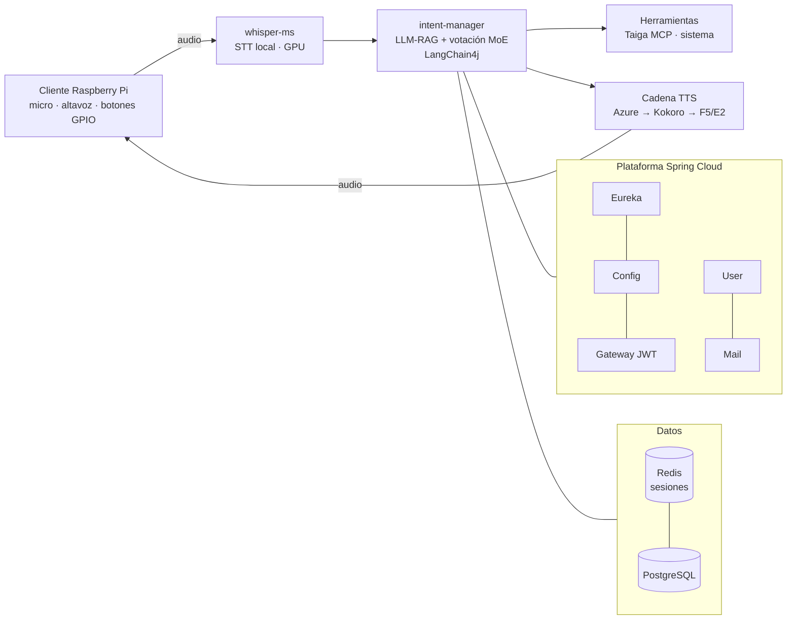

# puertocho-assistant — Asistente de voz de 2ª generación (2025)

> Asistente de voz autoalojado sobre arquitectura de microservicios Spring Boot: STT local con Whisper, gestor de intenciones LLM-RAG con **votación Mixture-of-Experts**, descomposición dinámica de tareas y cadena de TTS multi-motor — sirviendo a un cliente Raspberry Pi.

🇬🇧 [English version](README.md)

  

## Lo destacado

- 🗳️ **Gestión de intenciones MoE** — en lugar de un clasificador único, tres LLMs (GPT-4, Claude, GPT-3.5) votan en paralelo con un motor de consenso (umbral configurable, timeout de debate). Degradación elegante a LLM único y handlers genéricos en 5 niveles.
- 🧩 **Descomposición dinámica de tareas** — el LLM identifica subtareas y sus dependencias al vuelo (sin flujos predefinidos) y un orquestador las ejecuta en secuencia o en paralelo, con seguimiento de progreso y resolución de anáforas.
- 🎙️ **Pipeline de voz de extremo a extremo** — STT local con **Whisper** (GPU, fallback a API) → gestor de intenciones LLM-RAG → herramientas → cadena TTS (**Azure → Kokoro → F5/E2**).
- 🏗️ **Arquitectura de microservicios real** — descubrimiento con Eureka, configuración centralizada, gateway con JWT, health checks en todos los servicios, hot-reload de intenciones.

## Arquitectura

11 contenedores orquestados con Docker Compose: Eureka, Config, Gateway, User, Mail, Intent Manager, Whisper STT, 3 motores TTS, más Redis/PostgreSQL. Se conserva un servicio **Rasa** DU legacy (DIET + spaCy, español) como ruta NLU alternativa.

## Stack

| Capa | Tecnología |
|------|------------|
| Plataforma | Spring Boot 3 · Spring Cloud (Eureka, Config, Gateway) · JWT |
| Cerebro IA | LangChain4j · RAG con embeddings · votación MoE (GPT-4 / Claude / GPT-3.5) |
| Voz | Whisper (local, GPU) · Azure TTS · Kokoro TTS · F5/E2 TTS · Rasa (NLU legacy) |
| Datos | Redis (sesiones de conversación) · PostgreSQL |
| Cliente | Raspberry Pi 3 (64 bits) · Docker · controles GPIO |

## La serie de asistentes

| Gen | Proyecto | Periodo | Tema |
|-----|----------|---------|------|
| 1ª | [nuka](https://github.com/PuertOcho/nuka) | 2023–2024 | Asistente multimodal construido en la primera ola de la IA generativa |
| **2ª** | **puertocho-assistant** (este repo) | 2025 | Microservicios + pipeline de voz E2E con gestión de intenciones MoE |
| 3ª | [tony](https://github.com/PuertOcho/tony) | 2025–actualidad | Plataforma agéntica de producción |

> El desarrollo activo continúa en [tony](https://github.com/PuertOcho/tony), que evolucionó esta arquitectura hacia una plataforma agéntica completa.

## Autor

**Antonio Puerto** — AI Engineer, sistemas de IA de extremo a extremo, del LLM al firmware.
[GitHub](https://github.com/PuertOcho) · [LinkedIn](https://www.linkedin.com/in/antonio-puerto-borreguero/)
