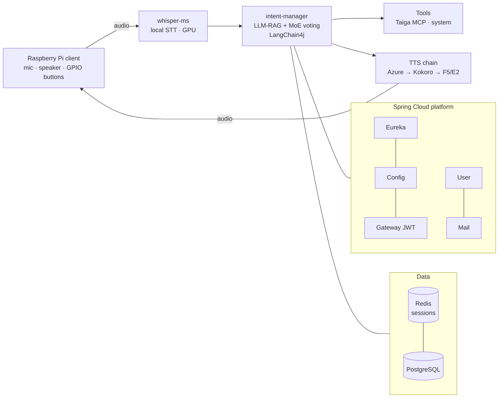

# puertocho-assistant — 2nd-generation voice AI assistant (2025)

> Self-hosted voice assistant on a Spring Boot microservice architecture: local Whisper STT, an LLM-RAG intent manager with **Mixture-of-Experts voting**, dynamic task decomposition and a multi-engine TTS chain — serving a Raspberry Pi client.

🇪🇸 [Versión en español](README.es.md)

  

## Highlights

- 🗳️ **MoE intent management** — instead of a single classifier, three LLMs (GPT-4, Claude, GPT-3.5) vote in parallel with a consensus engine (configurable threshold, debate timeout). Falls back gracefully to single-LLM and generic handlers across 5 degradation levels.
- 🧩 **Dynamic task decomposition** — the LLM identifies subtasks and their dependencies on the fly (no predefined flows) and an orchestrator executes them sequentially or in parallel, with progress tracking and anaphora resolution.
- 🎙️ **End-to-end voice pipeline** — local **Whisper** STT (GPU-enabled, API fallback) → LLM-RAG intent manager → tools → TTS chain (**Azure → Kokoro → F5/E2**).
- 🏗️ **Real microservice architecture** — Eureka service discovery, centralized config, JWT gateway, health checks on every service, hot-reload of intents.

## Architecture

11 containers orchestrated with Docker Compose: Eureka, Config, Gateway, User, Mail, Intent Manager, Whisper STT, 3× TTS engines, plus Redis/PostgreSQL. A legacy **Rasa** DU service (DIET + spaCy, Spanish) is kept as an alternative NLU path.

## Stack

| Layer | Tech |
|-------|------|
| Platform | Spring Boot 3 · Spring Cloud (Eureka, Config, Gateway) · JWT |
| AI brain | LangChain4j · RAG with embeddings · MoE voting (GPT-4 / Claude / GPT-3.5) |
| Voice | Whisper (local, GPU) · Azure TTS · Kokoro TTS · F5/E2 TTS · Rasa (legacy NLU) |
| Data | Redis (conversation sessions) · PostgreSQL |
| Client | Raspberry Pi 3 (64-bit) · Docker · GPIO controls |

## The assistant series

| Gen | Project | Period | Theme |
|-----|---------|--------|-------|
| 1st | [nuka](https://github.com/PuertOcho/nuka) | 2023–2024 | Multimodal assistant built in the first wave of generative AI |
| **2nd** | **puertocho-assistant** (this repo) | 2025 | Microservices + end-to-end voice pipeline with MoE intent management |
| 3rd | [tony](https://github.com/PuertOcho/tony) | 2025–present | Production agentic platform |

> Active development continues in [tony](https://github.com/PuertOcho/tony), which evolved this architecture into a full agentic platform.

## Author

**Antonio Puerto** — AI Engineer, end-to-end AI systems from the LLM to the firmware.
[GitHub](https://github.com/PuertOcho) · [LinkedIn](https://www.linkedin.com/in/antonio-puerto-borreguero/)
